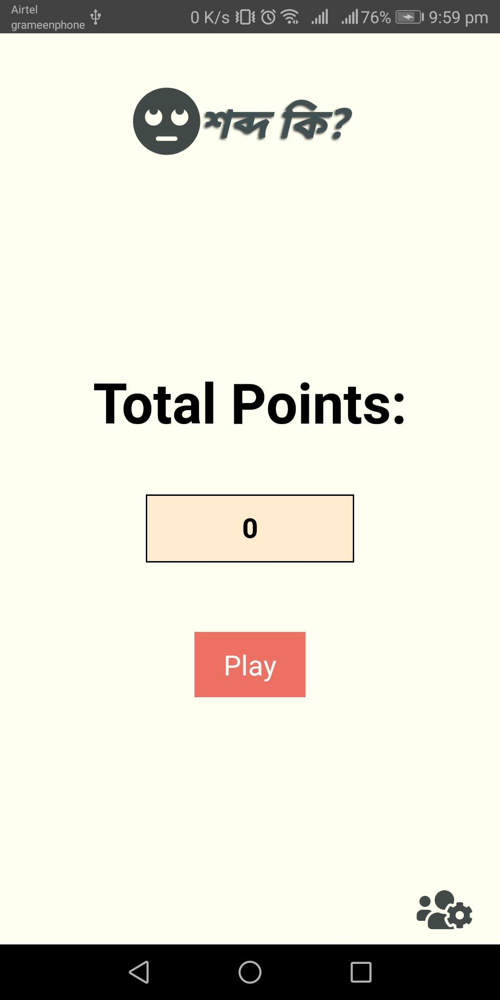
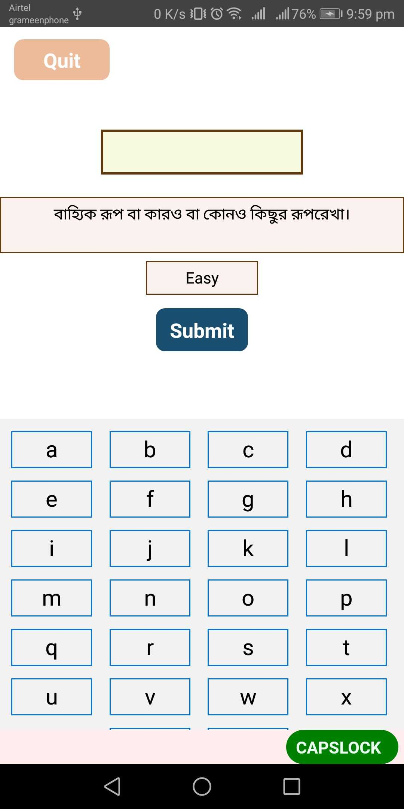
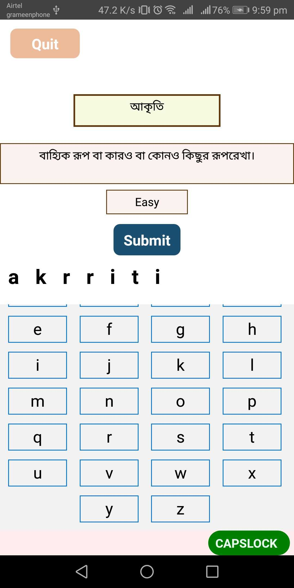
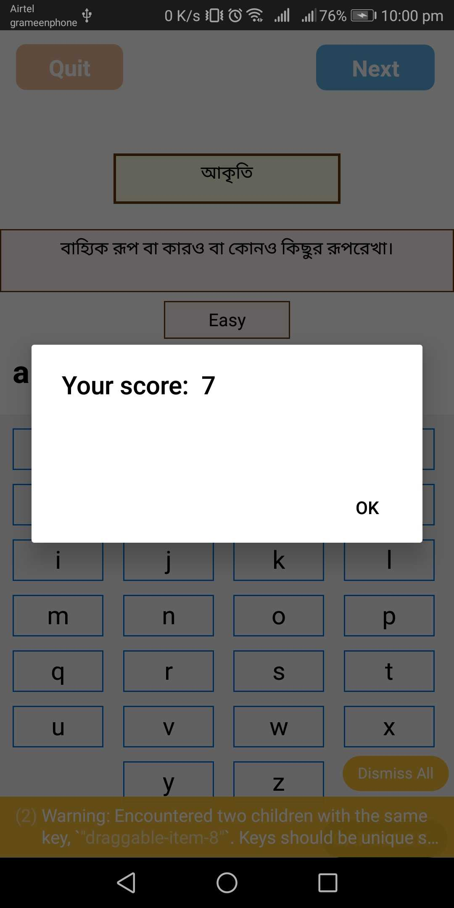
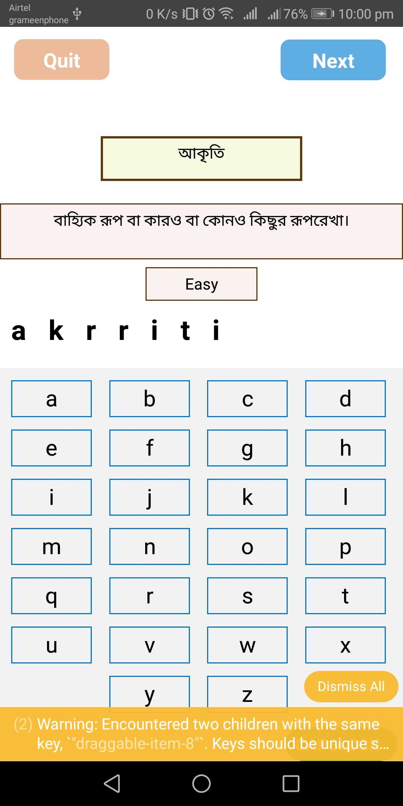
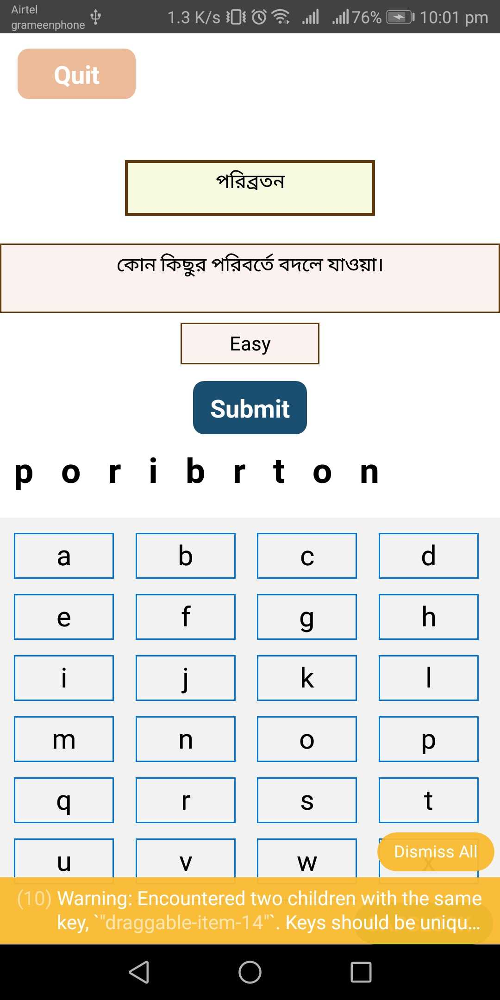
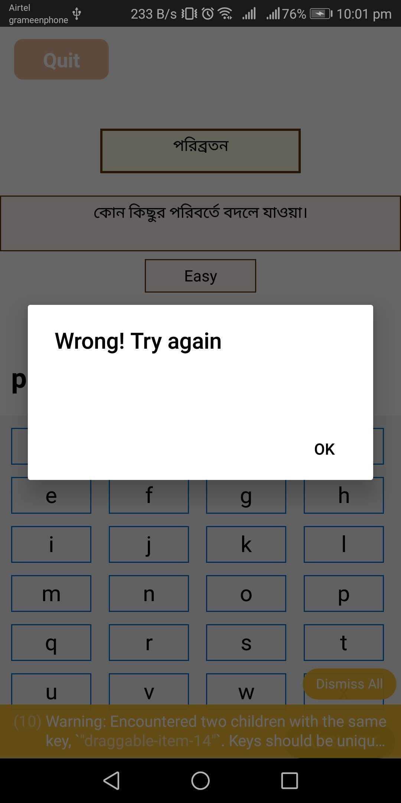
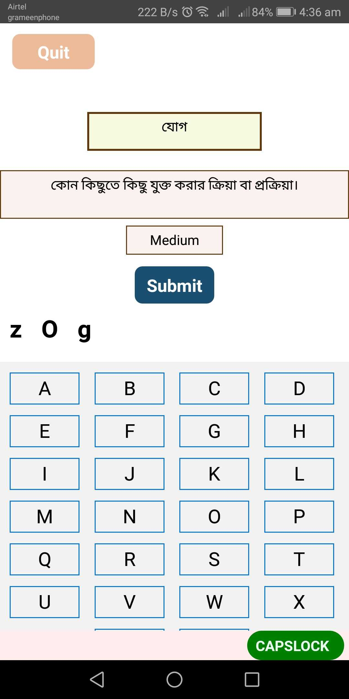
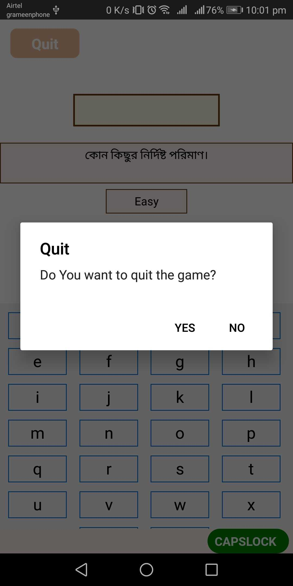

 # Features of the application:
 1. It's an offline game
 2. Phonetic Bengali word lookup.
 3. Learning Bengali words with its definition.
 4. Get a score with the word difficulty level.

# Screenshot of this application added below:

1. Home Page:

2. Hint with level shows up:

3. Write the word:

4. Shows valid messages along with the score if the word is correct:

5. After validation with correct word, the "Next" button will be visible. By clicking on "Next" button, the next hint and level will show up again:

6. Again write a word:

7. Shows wrong messages if the word is correct:

8. Capslock in the keyboard to write necessary word or letter:

9. Press "Quit" button to quit the game.

10. After quitting the game, it will return to home page and show the total score till your last game.

